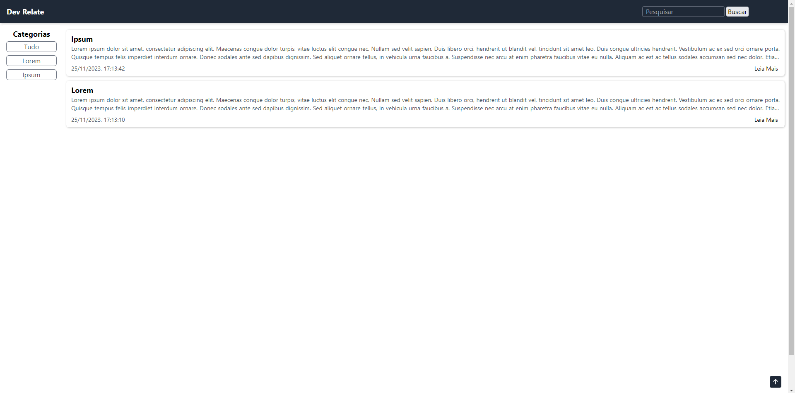
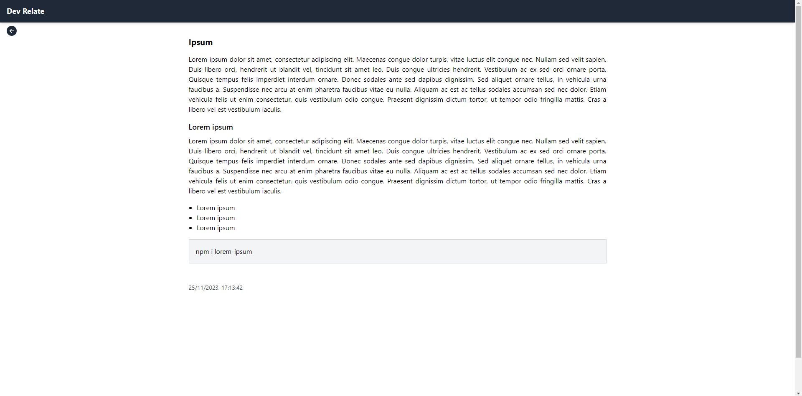

## Dev Relate

**Accessible project link: <a href="https://dev-relate-frontend.vercel.app/">Dev Relate</a>**

### What it is :
I've always really enjoyed studying and writing down the content I learned, however, I always had difficulty finding what I wrote down to consult when I needed it, which is why I developed this website. Here, it is possible to create articles based on categories, and filter them both by that category and by keywords. Furthermore, articles have pre-formatted tags to be written and displayed, as well as a preview of what is being written. I chose not to create documentation on how to run the project, because it has very specific characteristics for the purpose I created, in addition to not having a registration route to create an administrator (for security). However, the code is very self-explanatory for anyone who wants to try to get inspired and create something similar.

> Program developed in my native language (Portuguese).

### Technologies and libraries used :

- HTML, CSS , JavaScript
- React
- Tailwind CSS
- Node.js (Back-End)
- Expresss
- MongoDB

### Preview :

<table width="100%"> 
<tr>
<td width="50%">

</td> 
<td width="50%">

</td> 
</tr>
</table>